---
## Author
author:
  name: Верниковская Екатерина Андреевна
  degrees: DSc
  orcid: 0000-0002-0877-7063
  email: kulyabov-ds@rudn.ru
  affiliation:
    - name: Российский университет дружбы народов
      country: Российская Федерация
      postal-code: 117198
      city: Москва
      address: ул. Миклухо-Маклая, д. 6

## Title
title: "Отчёт"
subtitle: "Установка Kathara"
license: "CC BY"
---

# Цель работы

Установить Kathara

# Выполнение

## Что такое Kathara

Kathará — это легкая система эмуляции сетей на основе контейнеров, предназначенная для создания интерактивных демонстраций, тестирования сетевых сценариев в безопасной среде и разработки новых протоколов

Основные характеристики Kathará:

- Контейнеризация: Использует легкие контейнеры для эмуляции сетевых устройств
- Виртуальные LAN: Соединяет узлы через виртуальные сети, упрощая создание сложных топологий
- Простота: Предоставляет готовые к использованию образы для быстрого развертывания

## Установка Kathara на Linux

Нашли инструкцию по установке на сайте <https://github.com/KatharaFramework/Kathara.git>

Рекомендуется установить эмулятор терминала xterm, который используется по умолчанию: ```sudo apt install xterm``` ([рис. @fig-001])

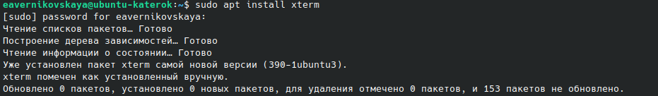{#fig-001 width=70%}

Добавили открытый ключ Kathara в свою систему: ```sudo apt-key adv --keyserver keyserver.ubuntu.com --recv-keys 21805A48E6CBBA6B991ABE76646193862B759810``` ([рис. @fig-002])

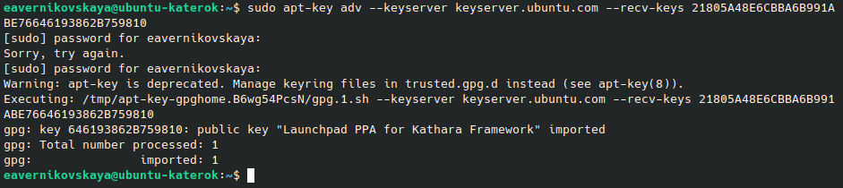{#fig-002 width=70%}

Добавили репозиторий Kathara в свой список репозиториев: ```sudo add-apt-repository ppa:katharaframework/kathara``` ([рис. @fig-003])

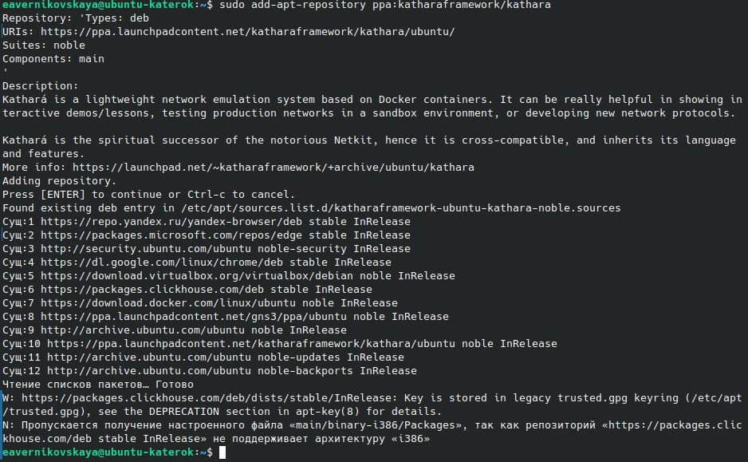{#fig-003 width=70%}

Обновили список пакетов: ```sudo apt update``` ([рис. @fig-004])

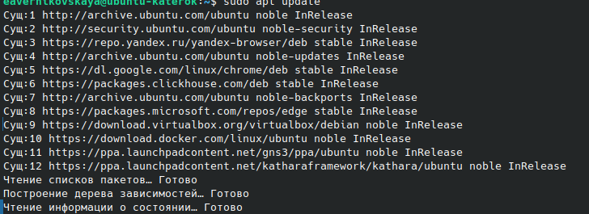{#fig-004 width=70%}

Устанавили Kathara: ```sudo apt install kathara``` ([рис. @fig-005])

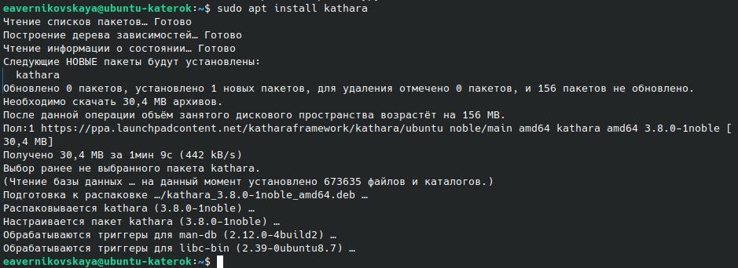{#fig-005 width=70%}

Проверили системную среду: ```kathara check``` ([рис. @fig-006])

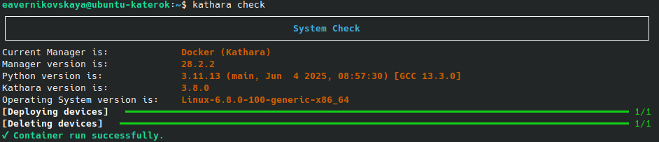{#fig-006 width=70%}

## Работа с Kathara

Создали lab директорию ([рис. @fig-007])

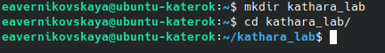{#fig-007 width=70%}

Для проверки работы Kathara создали топологию из маршрутизатора и двух хостов. В файле *lab.conf* описывается топология сети ([рис. @fig-008]):

```
pc1[0]="A"

r1[0]="A"
r1[1]="B"

pc2[0]="B"
```

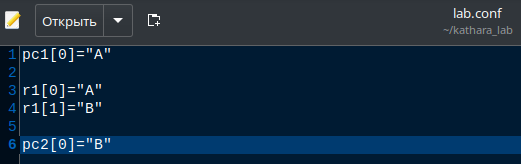{#fig-008 width=70%}

В файлах *.startup* описываются действия, выполняемые устройствами при их запуске

Опишем 2 хоста и маршрутизатор файлах *pc1.startup*, *pc2.startup*, *r1.startup* ([рис. @fig-009]), ([рис. @fig-010]), ([рис. @fig-011]):

- Описание pc1:

```
ip addr add 10.0.0.10/24 dev eth0
ip route add 10.10.0.0/24 via 10.0.0.1
```

- Описание pc2:

```
ip addr add 10.10.0.10/24 dev eth0
ip route add 10.0.0.0/24 via 10.10.0.1
```

- Описание r1:

```
ip addr add 10.0.0.1/24 dev eth0
ip addr add 10.10.0.1/24 dev eth1
```

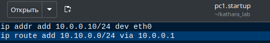{#fig-009 width=70%}

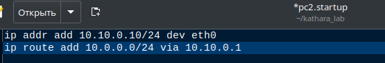{#fig-010 width=70%}

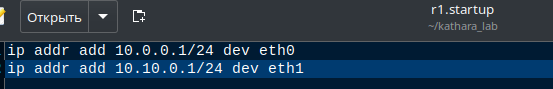{#fig-011 width=70%}

Запустим сетевой сценарий: ```kathara lstart``` ([рис. @fig-012])

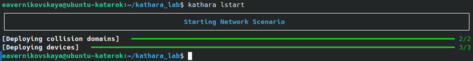{#fig-012 width=70%}
 
Посмотрим список устройств: ```kathara list``` ([рис. @fig-013])

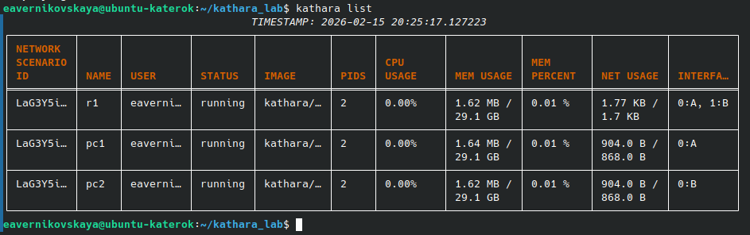{#fig-013 width=70%}

Пропингуем pc2 с pc1 и pc1 с pc2. Пинг проходит успешно ([рис. @fig-014]), ([рис. @fig-015])

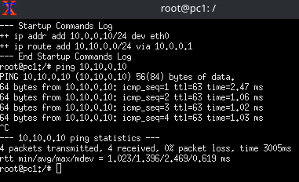{#fig-014 width=70%}

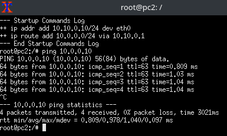{#fig-015 width=70%}

# Выводы

Установили Kathara

# Список литературы

1. [Kathara github](https://github.com/KatharaFramework/Kathara.git)
