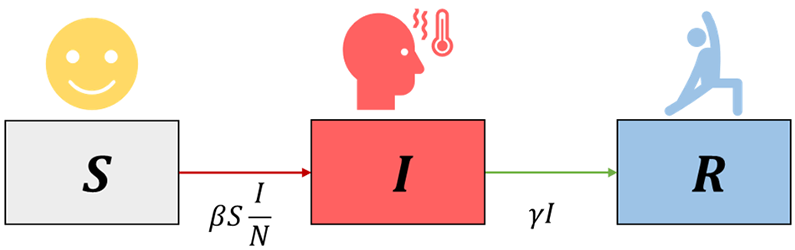
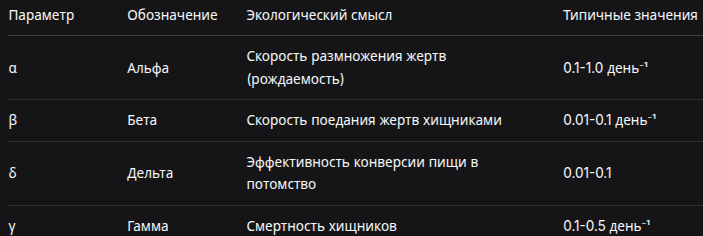

---
## Author
author:
  name: Верниковская Екатерина Андреевна
  degrees: DSc
  orcid: 0000-0002-0877-7063
  email: kulyabov-ds@rudn.ru
  affiliation:
    - name: Российский университет дружбы народов
      country: Российская Федерация
      postal-code: 117198
      city: Москва
      address: ул. Миклухо-Маклая, д. 6

## Title
title: "Основные модели"
subtitle: "Дисциплина: Имитационное моделирование"
license: "CC BY"
---

# Основные модели

## Модель SIR

Модель SIR - это фундаментальная математическая модель в эпидемиологии, которая описывает распространение инфекционного заболевания в закрытой популяции. Название происходит от трёх групп (компартментов), на которые делится популяция:

- S - Susceptible (Восприимчивые): люди, которые не болели, не имеют иммунитета и могут заразиться
- I - Infectious (Инфицированные/Заразные): люди, которые в данный момент больны и могут передавать инфекцию
- R - Recovered (Выздоровевшие/Удаленные): люди, которые переболели и приобрели иммунитет (или умерли). Они больше не участвуют в процессе передачи

{#fig-001 width=70%}

Ключевые допущения:

- Закрытая популяция: Общая численность населения ```N = S + I + R``` постоянна (рождения, смерти от других причин и миграция не учитываются)
- Однородное смешение: Каждый восприимчивый имеет одинаковую вероятность встретиться с каждым заразным
- Постоянные параметры: Параметры заразности $\beta$ и выздоровления $\gamma$ не меняются со временем
- Отсутствие инкубационного периода и пожизненный иммунитет: После заражения человек сразу становится заразным, а после выздоровления приобретает стойкий иммунитет

### Базовая модель

Динамика модели описывается тремя уравнениями, которые показывают, как меняется число людей в каждой группе во времени.

1. Уравнение для восприимчивых (S): $$\frac{dS}{dt} = -\frac{\beta I S}{N}$$

- $\frac{dS}{dt}$ - скорость изменения числа восприимчивых
- $\beta$ - коэффициент заражения (infection rate). Показывает, сколько в среднем человек заражает других в единицу времени, если все вокруг восприимчивы
- $-\frac{\beta I S}{N}$ - число новых случаев в единицу времени. Пропорционально и числу заразных (I), и доле восприимчивых (S/N). Знак минус показывает, что число восприимчивых уменьшается

2. Уравнение для заразных (I): $$\frac{dI}{dt} = \frac{\beta I S}{N} -\gamma I $$

- $\frac{dI}{dt}$ - скорость изменения числа заразных
- $\frac{\beta I S}{N}$ - приток новых больных (т.е, кто перешёл из S)
- $\gamma$ - коэффициент выздоровления (recovery rate). Обратная величина 1/$\gamma$ - это средняя продолжительность болезни (в тех же единицах времени, что и t)
- $\gamma I$ - отток людей, которые выздоровели (перешли в R)

3. Уравнение для выздоровевших (R): $$\frac{dR}{dt} = \gamma I $$

- $\frac{dR}{dt}$ - скорость изменения числа выздоровевших
- $\gamma I$ - поток людей, выздоравливающих из группы I

Ключевые параметры и показатели — это числовые характеристики модели ($\beta$, c (будет позже, в трёхпараметрической модели), $\gamma$) и производные от них величины ($R_0$, $R_e$, порог коллективного иммунитета), которые определяют скорость распространения инфекции, силу эпидемии и позволяют прогнозировать её динамику, оценивать эффективность мер и принимать управленческие решения.

1. Базовое репродуктивное число $R_0$: $R_0 = \frac{\beta}{\gamma}$ - cреднее число людей, которых заражает один больной за все время своей болезни, в полностью восприимчивой популяции (когда S ≈ N)

- $R_0$ > 1: эпидемия будет расти (каждый больной заражает больше одного человека)
- $R_0$ < 1: вспышка затухнет

2. Эффективное репродуктивное число $R_e$: $R_e = R_0 \frac{S}{N}$ - учитывает, что со временем восприимчивых становится меньше. Эпидемия начинает сходить на нет, когда $R_e$ падает ниже 1 не из-за принятых мер, а из-за исчерпания пула восприимчивых

3. Порог коллективного иммунитета (Herd Immunity Threshold): $1 - \frac{1}{R_0}$ - это число должна превысить доля иммунных (либо переболевших, либо вакцинированных) чтобы эпидемия не могла начаться

### Трёхпараметрическая модель SIR

В классической двухпараметрической модели ($\beta$, $\gamma$) параметр $\beta$ (коэффициент заражения) является составным. Он скрывает в себе два процесса:

- Контакт между людьми (поведенческий, управляемый фактор)
- Передачу инфекции при контакте (биологический фактор)

Трёхпараметрическая модель делает это разделение явным:

- $c$ - среднее число контактов одного человека в единицу времени
- $\beta$ - вероятность передачи инфекции при одном контакте между заразным и восприимчивым (величина от 0до 1)
- $\gamma$ - скорость выздоровления. А 1/$\gamma$ - это средняя продолжительность заразного
периода

Итоговый параметр силы заражения теперь выражается как произведение $c$ * $\beta$

Математическая формулировка:

1. Уравнение для восприимчивых (S): $$\frac{dS}{dt} = -\frac{\beta c I S}{N}$$

- $\frac{dS}{dt}$ - скорость изменения числа восприимчивых
- $\beta$ - вероятность передачи инфекции при одном контакте
- $c$ - среднее число контактов одного человека в день. Их произведение, $c$ * $\beta$, - это коэффициент заражения
- $I$ - число заразных
- $\frac{S}{N}$ - доля восприимчивых в популяции
- $-\frac{\beta c I S}{N}$ - число новых заражений в день. Знак минус показывает, что число восприимчивых уменьшается

2. Уравнение для заразных (I): $$\frac{dI}{dt} = \frac{\beta c I S}{N} -\gamma I $$

- $\frac{dI}{dt}$ - скорость изменения числа заразных
- $\frac{\beta c I S}{N}$ - приток новых больных (т.е, кто перешёл из S)
- $\gamma$ - скорость выздоровления. Обратная величина 1/$\gamma$ - это средняя продолжительность болезни в днях
- $\gamma I$ - отток людей, которые выздоровели (перешли в R)

3. Уравнение для выздоровевших (R): $$\frac{dR}{dt} = \gamma I $$

- $\frac{dR}{dt}$ - скорость изменения числа выздоровевших
- $\gamma I$ - поток людей, выздоравливающих из группы I

Ключевые показатели:

1. Базовое репродуктивное число $R_0$: $R_0 = \frac{c \beta}{\gamma}$

- c$\beta$ - это среднее число людей, которых заражает один больной за один день, если все вокруг восприимчивы
- 1/$\gamma$ - это количество дней, которые человек в среднем заразен

$R_0$ = (число заражений в день) × (число заразных дней).

Остальное без изменений

## Модель Лотки–Вольтерры

Модель Лотки-Вольтерры - это фундаментальная математическая модель в экологии, описывающая динамику взаимодействия двух видов: хищников и жертв.

Основные допущения модели:

- Закрытая система: нет миграции, популяции изолированы
- Неограниченные ресурсы для жертв: в отсутствие хищников жертвы растут экспоненциально
- Линейная функциональная реакция: вероятность встречи хищника и жертвы пропорциональна произведению их численностей
- Постоянные параметры: коэффициенты не меняются со временем
- Отсутствие внутривидовой конкуренции: нет конкуренции за ресурсы внутри вида
- Хищники питаются только жертвами: нет альтернативных источников пищи
- Отсутствие временных задержек: все процессы происходят мгновенно

Система состоит из двух дифференциальных уравнений. 

1. Уравнение для жертв (x): $\frac{dx}{dt} = \alpha x - \beta x y$

где: $\alpha$ > 0 - коэффициент естественного прироста жертв (рождаемость); $\beta$ > 0 - коэффициент поедания жертв хищниками; xy - вероятность встречи хищника и жертвы (закон массового действия)

Численность жертв увеличивается за счёт размножения ($\alpha x$) и уменьшается за счёт поедания хищниками ($\beta x y$)

2. Уравнение для хищников (y): $\frac{dy}{dt} = \delta x y - \gamma y$

где: $\delta$ > 0 - коэффициент конверсии (эффективность превращения съеденных жертв в потомство хищников); $\gamma$ > 0 - коэффициент естественной смертности хищников

Численность хищников увеличивается за счёт питания жертвами ($\delta x y$) и уменьшается за счёт естественной смертности ($\gamma y$)

{#fig-001 width=70%}





# Выводы

В ходе выполнения лабораторной работы №1 мы подготовили рабочее пространство для выполнения программ и приобрели необходимые навыки создания и преобразования программ на Julia

# Список литературы

1. [Лаборатораня работа №1](https://esystem.rudn.ru/pluginfile.php/3094821/mod_resource/content/1/mathmod-lab.pdf)
