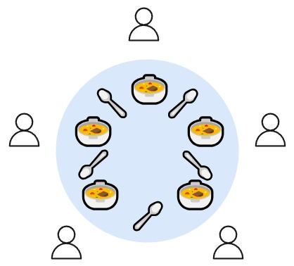

---
## Author
author:
  name: Верниковская Екатерина Андреевна
  degrees: DSc
  orcid: 0000-0002-0877-7063
  email: kulyabov-ds@rudn.ru
  affiliation:
    - name: Российский университет дружбы народов
      country: Российская Федерация
      postal-code: 117198
      city: Москва
      address: ул. Миклухо-Маклая, д. 6

## Title
title: "Сети Петри"
subtitle: "Дисциплина: Имитационное моделирование"
license: "CC BY"
---

# Реализация основных моделей в агентном подходе

## Сети Петри

**Сеть Петри** - математический аппарат для моделирования дискретных систем с параллелизмом, асинхронностью и синхронизацией. Графически это двудольный ориентированный граф, содержащий два типа вершин:

- **Позиции (places)** - пассивные элементы (кружки), описывающие состояние системы. Внутри могут находиться фишки (tokens)
- **Переходы (transitions)** - активные элементы (прямоугольники), описывающие события

**Правило срабатывания:** переход разрешён, если во всех его входных позициях есть нужное количество фишек. При срабатывании фишки из входных позиций удаляются и добавляются в выходные

**Ключевые свойства:** ограниченность, активность (живость), достижимость, сохраняемость

## Обедающие философы (задача Дейкстры)

**Постановка:** N философов сидят за круглым столом. У каждого своя тарелка, между соседями - одна вилка. Чтобы поесть, нужны две вилки (левая и правая)

**Проблема:** при наивной реализации (каждый сначала берёт левую вилку) возникает **взаимная блокировка (deadlock)** - все философы держат по одной вилке и ждут вторую.

**Решение (в работе):** добавление арбитра - дополнительной позиции с N‑1 фишками, ограничивающей количество одновременно едящих философов

**Моделирование:** каждый философ имеет состояния «Думает» → «Голоден» → «Ест». Переходы: взять левую вилку, взять правую вилку, положить вилки



## Основные скрипты

```src/DiningPhilosophers.jl``` - модуль с определением сети Петри, построением классической модели и модели с арбитром, функциями симуляции (ODE, стохастика), обнаружения deadlock и визуализации

```scripts/dining_philosophers.jl``` - запуск стохастического моделирования для обеих моделей, сохранение CSV и графиков, вывод факта deadlock

```scripts/dining_philosophers_animation_classic.jl``` - создание GIF-анимации изменения маркировки сети Петри во времени для классической сети

```scripts/dining_philosophers_animation_arbiter.jl``` - создание GIF-анимации изменения маркировки сети Петри во времени для сети с арбитром

```scripts/dining_philosophers_report.jl``` - построение итогового сравнительного графика числа «едящих» философов для классической модели и модели с арбитром

## Код модели

```{julia}
module DiningPhilosophers

using OrdinaryDiffEq
using Plots
using DataFrames
using Random, LinearAlgebra

export build_classical_network, build_arbiter_network
export simulate_ode, simulate_stochastic
export detect_deadlock, plot_marking_evolution

### Определение простой структуры PetriNet
struct PetriNet
    n_places::Int
    n_transitions::Int
    incidence::Matrix{Int}
    place_names::Vector{Symbol}
    transition_names::Vector{Symbol}
end

function PetriNet(
        n_places,
        n_transitions;
        place_names = Symbol[],
        transition_names = Symbol[],
    )

    incidence = zeros(Int, n_places, n_transitions)
    if isempty(place_names)
        place_names = [Symbol("p$i") for i = 1:n_places]
    end
    if isempty(transition_names)
        transition_names = [Symbol("t$i") for i = 1:n_transitions]
    end
    PetriNet(n_places, n_transitions, incidence, place_names, transition_names)
end

function add_arc!(net::PetriNet, place::Int, transition::Int, sign::Int)
    net.incidence[place, transition] += sign
end

### Построение сетей Петри
function build_classical_network(N::Int)
    n_places = 4N
    n_transitions = 3N
    net = PetriNet(n_places, n_transitions)

    for i = 1:N
        net.place_names[i] = Symbol("Think_$i")
        net.place_names[N+i] = Symbol("Hungry_$i")
        net.place_names[2N+i] = Symbol("Eat_$i")
        net.place_names[3N+i] = Symbol("Fork_$i")
    end

    for i = 1:N
        net.transition_names[i] = Symbol("GetLeft_$i")
        net.transition_names[N+i] = Symbol("GetRight_$i")
        net.transition_names[2N+i] = Symbol("PutForks_$i")
    end

    for i = 1:N
        think = i
        hungry = N + i
        eat = 2N + i

        left_fork = 3N + i
        right_fork = 3N + (i % N + 1)

        get_left = i
        get_right = N + i
        put_forks = 2N + i

        add_arc!(net, think, get_left, -1)
        add_arc!(net, left_fork, get_left, -1)
        add_arc!(net, hungry, get_left, +1)

        add_arc!(net, hungry, get_right, -1)
        add_arc!(net, right_fork, get_right, -1)
        add_arc!(net, eat, get_right, +1)

        add_arc!(net, eat, put_forks, -1)
        add_arc!(net, think, put_forks, +1)
        add_arc!(net, left_fork, put_forks, +1)
        add_arc!(net, right_fork, put_forks, +1)
    end

    u0 = zeros(Float64, n_places)

    for i = 1:N
        u0[i] = 1.0 # Think_i
        u0[3N+i] = 1.0 # Fork_i
    end

    return net, u0, net.place_names
end

function build_arbiter_network(N::Int)
    n_places = 4N + 1
    n_transitions = 3N
    net = PetriNet(n_places, n_transitions)

    for i = 1:N
        net.place_names[i] = Symbol("Think_$i")
        net.place_names[N+i] = Symbol("Hungry_$i")
        net.place_names[2N+i] = Symbol("Eat_$i")
        net.place_names[3N+i] = Symbol("Fork_$i")
    end

    net.place_names[4N+1] = :Arbiter

    for i = 1:N
        net.transition_names[i] = Symbol("GetLeft_$i")
        net.transition_names[N+i] = Symbol("GetRight_$i")
        net.transition_names[2N+i] = Symbol("PutForks_$i")
    end

    arbiter_idx = 4N + 1

    for i = 1:N
        think = i
        hungry = N + i
        eat = 2N + i
        left_fork = 3N + i
        right_fork = 3N + (i % N + 1)
        get_left = i
        get_right = N + i
        put_forks = 2N + i
        add_arc!(net, think, get_left, -1)
        add_arc!(net, left_fork, get_left, -1)
        add_arc!(net, arbiter_idx, get_left, -1)
        add_arc!(net, hungry, get_left, +1)
        add_arc!(net, hungry, get_right, -1)
        add_arc!(net, right_fork, get_right, -1)
        add_arc!(net, eat, get_right, +1)
        add_arc!(net, eat, put_forks, -1)
        add_arc!(net, think, put_forks, +1)
        add_arc!(net, left_fork, put_forks, +1)
        add_arc!(net, right_fork, put_forks, +1)
        add_arc!(net, arbiter_idx, put_forks, +1)
    end

    u0 = zeros(Float64, n_places)
    for i = 1:N
        u0[i] = 1.0
        u0[3N+i] = 1.0
    end

    u0[arbiter_idx] = N - 1
    return net, u0, net.place_names
end

### Детерминированное моделирование (ODE)
function vectorfield(net::PetriNet, rates = ones(net.n_transitions))
    function f!(du, u, params, t)
        a = zeros(net.n_transitions)
        for j = 1:net.n_transitions
            rate = rates[j]
            prod = rate
            for i = 1:net.n_places
                if net.incidence[i, j] < 0
                    prod *= u[i] ^ (-net.incidence[i, j])
                end
            end
            a[j] = prod
        end
        du .= net.incidence * a
    end
    return f!
end

function simulate_ode(net::PetriNet, u0::Vector{Float64}, tmax::Float64; saveat = 0.1)
    f = vectorfield(net)
    prob = ODEProblem(f, u0, (0.0, tmax))
    sol = solve(prob, Tsit5(), saveat = saveat)
    df = DataFrame(time = sol.t)
    for i = 1:net.n_places
        df[!, String(net.place_names[i])] = sol[i, :]
    end
    return df
end

### Стохастическое моделирование (алгоритм Гиллеспи)
function simulate_stochastic(
        net::PetriNet,
        u0::Vector{Float64},
        tmax::Float64;
        rates = ones(net.n_transitions),
        rng = Random.GLOBAL_RNG,
    )
    u = copy(u0)
    t = 0.0
    times = [t]
    states = [copy(u)]

    while t < tmax
        a = zeros(net.n_transitions)
        for j = 1:net.n_transitions
            rate = rates[j]
            prod = rate
            for i = 1:net.n_places
                if net.incidence[i, j] < 0
                    prod *= u[i] ^ (-net.incidence[i, j])
                end
            end
            a[j] = prod
        end
        a0 = sum(a)
        if a0 == 0
            break
        end
        dt = -log(rand(rng)) / a0
        r = rand(rng) * a0
        cumsum = 0.0
        chosen = 1
        for j = 1:net.n_transitions
            cumsum += a[j]
            if r <= cumsum
                chosen = j
                break
            end
        end
        for i = 1:net.n_places
            u[i] += net.incidence[i, chosen]
        end
        t += dt
        if t <= tmax
            push!(times, t)
            push!(states, copy(u))
        end
    end
    df = DataFrame(time = times)
    for i = 1:net.n_places
        df[!, String(net.place_names[i])] = [s[i] for s in states]
    end
    return df
end

### Обнаружение deadlock
function detect_deadlock(df::DataFrame, net::PetriNet; tol = 1e-6)
    u_last = [df[end, String(net.place_names[i])] for i = 1:net.n_places]
    for j = 1:net.n_transitions
        can_fire = true
        for i = 1:net.n_places
            if net.incidence[i, j] < 0 && u_last[i] < -net.incidence[i, j] - tol
                can_fire = false
                break
            end
        end
        if can_fire
            return false
        end
    end
    return true
end

### Визуализация
function plot_marking_evolution(df::DataFrame, N::Int)
    plots = []
    for group in ["Think", "Hungry", "Eat", "Fork"]
        p = plot(xlabel = "Time", ylabel = group, title = "$group states")
        for i = 1:N
            col = "$(group)_$i"
            if col in names(df)
                plot!(df.time, df[!, col], label = "$(group)_$i")
            end
        end
        push!(plots, p)
    end
    return plot(plots..., layout = (4, 1), size = (800, 1000))
end

end # module
```








